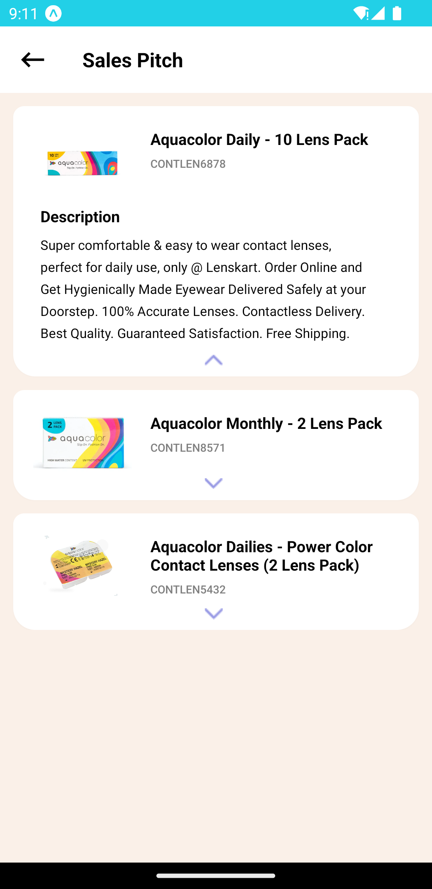

# react-native-accordion library

User customisable Animated React Native Accordion with React 18 and React Native 0.69.3 Support and the downward show content button extends the content

# Example Screenshot



## Installation

```bash
npm install --save @syeadmaaz/react-native-accordion
```

## Usage

```js
import Accordion from "@syeadmaaz/react-native-accordion";

<Accordion headerTitle="Title">
  <View>
    <Image source={imageUrl} />
    <Text>{description}</Text>
  </View>
</Accordion>;
```

You can also show arrow button on the bottom and override accordion header content:

```js
<Accordion
  showButton
  style={styles.accordion}
  renderHeader={() => renderAccordionHeader()}
>
  <View>
    <Image source={imageUrl} />
    <View style={styles.headerValue}>
      <Text style={styles.headerLabelText}>{title}</Text>
      <Text style={styles.headerValueText}>{description}</Text>
    </View>
  </View>
</Accordion>
```

## Properties

| Prop                      | Description                                     | Default               |
| ------------------------- | ----------------------------------------------- | --------------------- |
| **`headerStyle`**         | Optional styling for the header title container | `{}`                  |
| **`headerTitle`**         | Header title text                               |                       |
| **`headerTitleStyle`**    | Header title text style                         |                       |
| **`showButton`**          | Show accordion bottom button                    | `false`               |
| **`buttonStyle`**         | Accordion bottom button style                   | `{}`                  |
| **`renderHeader`**        | Render own accordion header                     | `() => {}`            |
| **`style`**               | Optional styling for the container              |                       |
| **`renderButtonContent`** | Render own accordion bottom button              | `(showContent) => {}` |

<!-- ## Running example app

```sh
git clone git@github.com:syeadmaaz/react-native-accordion.git
cd react-native-accordion/example
yarn
npm run ios
``` -->

## License

MIT
